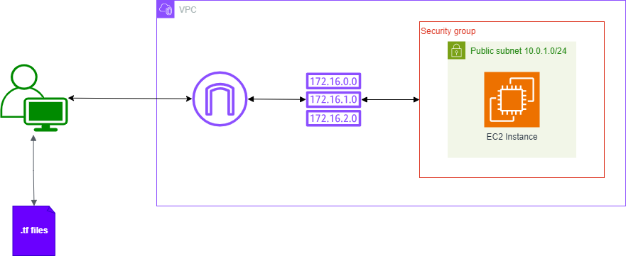

# Build-n-grow-terraform

Deploy a simple AWS infrastructure using Terraform.

<!-- Repository for my Terraform configurations -->

## Deploying a Simple Infrastructure on AWS with Terraform

|  |
|:-:|
| *Diagram of a Simple AWS Infrastructure* |

### Prerequisites

- Access to an AWS account with non-root admin creds/tokens. Tips [here](https://docs.aws.amazon.com/IAM/latest/UserGuide/security-creds.html)
- Terraform installed locally. Tips [here](https://developer.hashicorp.com/terraform/tutorials/aws-get-started/install-cli)
- AWS CLI. Tips [here](https://docs.aws.amazon.com/cli/latest/userguide/getting-started-install.html)

### Setting up your AWS account

After installing terraform

### Key Takeaways from the Project

---

This mini-project afforded me the understanding of Terraform and how it generally interacts with the Cloud.

I also understood that Terraform mostly excels in infrastructure deployment to various Cloud platforms and not really maintaining or managing said Infrastructure.  
This task is better left to the likes of Ansible, Puppet, e.t.c

Key takeaways particular to Terraform operations include;

- Providers, resources, data, variables, and imports. How these really come together, building on AWS APIs.

- Terraform state, different ways to manage and monitor the TF state, best practices, and differences with 

- A refresher on ssh key management and best practices.

- Key TF commands like;

  - **init**: Initializes the directory with terraform, and the providers referenced. Most especially, creates a lock file that keeps track of provider versions, thereby avoiding breaking changes.

  - **show**: Shows the entire Deployment state.

  - **state list**: Oneline listing of resources in the state.

  - **plan**: Documents chnges to be made upon comparison of existing infra with the terraform state.

  - **apply**: Makes the changes, effectively bringing the current state to the desired state.

  - **destroy**: Tears down infrastructure deployed by recursively decommissioning infrastructure tracked in it's state.

  - **validate, fmt** Checks TF syntax and beautifies TF files respectively.
